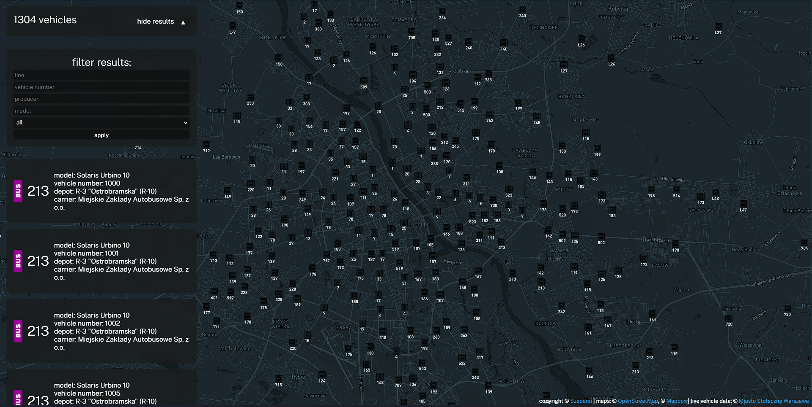

# Warsaw ZTM Vehicle tracker

## A web app which allows users to view live data for [ZTM](https://www.ztm.waw.pl/) vehicles

## Technologies used:
* [Next.js](https://nextjs.org/)
* [Typescript](https://www.typescriptlang.org/)
* [MongoDB](https://www.mongodb.com/)
* [Mapbox](https://www.mapbox.com/)
* [Miasto Stołeczne Warszawa](https://api.um.warszawa.pl/)

## Images
>### Main page
>

>### Vehicle selected
>

>### Results hidden
>